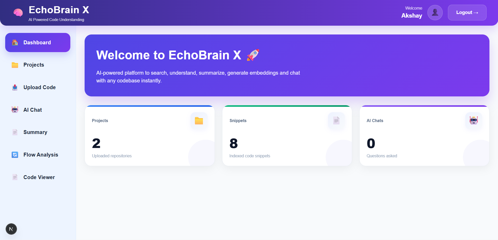
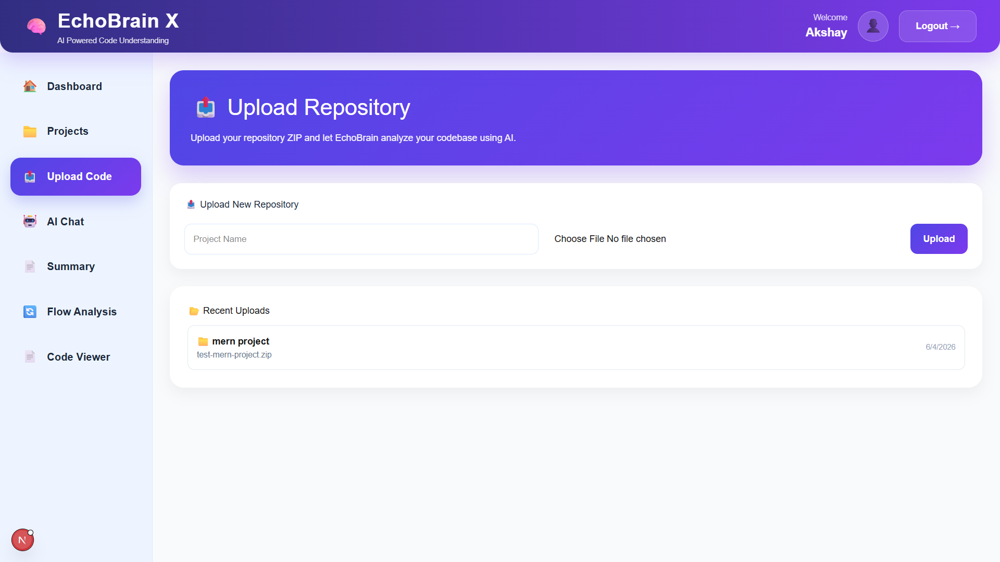
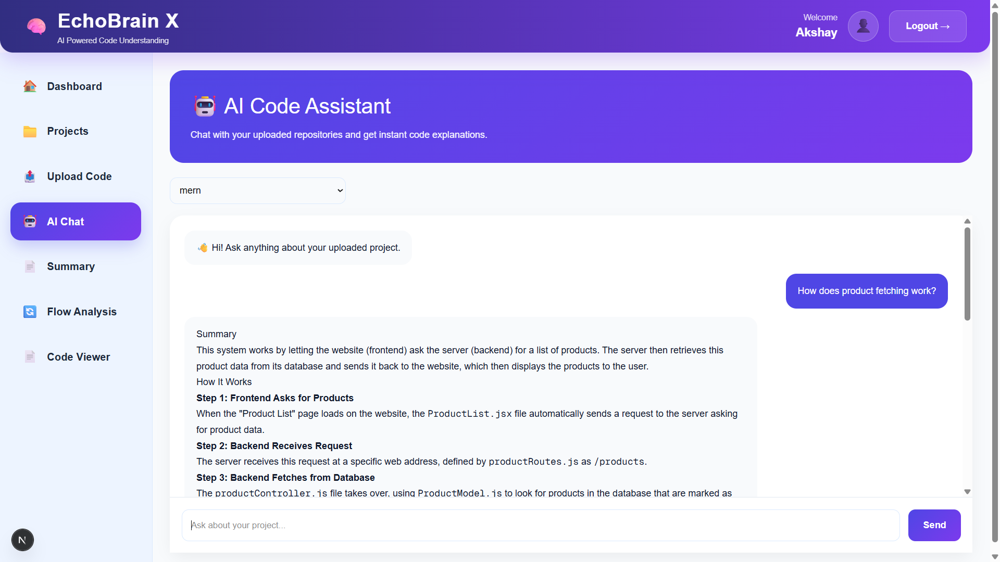
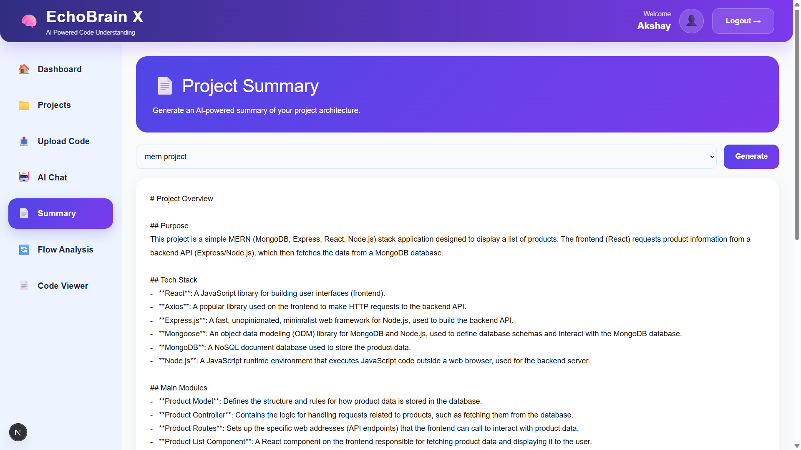
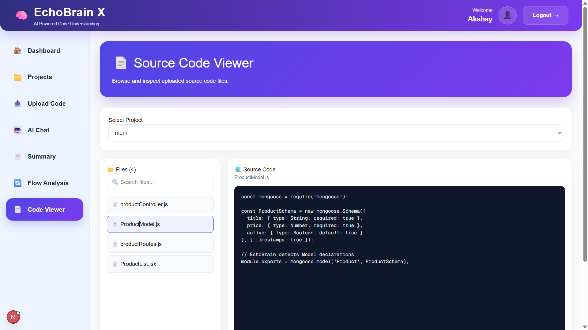

<div align="center">


# 🧠 EchoBrain X

### 🚀 AI-Powered Repository Intelligence Platform

Upload repositories, analyze architecture, generate summaries, perform semantic code search, browse source code, and chat with your entire codebase using Artificial Intelligence.

<p align="center">


</p>

<p align="center">


</p>

---

### 🧠 Understand Any Repository in Minutes, Not Hours

📂 Upload Repositories • 🤖 AI Code Chat • 📄 Project Summaries • 🔍 Semantic Search • 📑 Source Code Viewer • 🏗 Architecture Analysis

</div>

---

# 🚀 Overview

**EchoBrain X** is a next-generation AI-powered repository intelligence platform designed to help developers understand, explore, and analyze unfamiliar codebases effortlessly.

Instead of spending hours manually navigating through hundreds of files, developers can upload a repository and instantly gain deep insights through AI-driven analysis, semantic search, and intelligent code conversations.

Whether you're onboarding to a new project, preparing for interviews, reviewing open-source repositories , EchoBrain X transforms complex codebases into clear, interactive knowledge.

### 🎯 What EchoBrain X Provides

✅ AI-Powered Repository Chat

✅ Automated Project Summaries

✅ Architecture & Execution Flow Analysis

✅ Semantic Code Search

✅ Source Code Exploration

✅ Module & API Understanding

✅ Faster Developer Onboarding

✅ Intelligent Repository Insights

---

# ✨ Core Features

## 📂 Repository Upload & Processing Engine

Upload any project repository as a ZIP file and let EchoBrain X automatically transform raw source code into an AI-searchable knowledge base.

### Processing Pipeline

- Extracts source code files
- Analyzes project structure
- Chunks source files intelligently
- Generates vector embeddings
- Stores searchable snippets
- Builds repository context for AI

### Supported Benefits

- Faster repository understanding
- No manual code exploration
- Instant project indexing
- AI-ready contextual processing

---

## 🤖 AI Repository Chat

Interact with your codebase using natural language.

Ask questions like:

```text
How does authentication work?

Which file handles products?

Explain the user registration flow.

Where is JWT implemented?

How are APIs connected to MongoDB?

Show me the login process.
```

### How It Works

1. Retrieves relevant code snippets
2. Performs semantic similarity search
3. Builds contextual prompts
4. Sends context to Gemini AI
5. Generates human-friendly explanations

### Benefits

- Understand code faster
- Reduce onboarding time
- Learn unfamiliar repositories
- Explore business logic easily

---

## 📄 AI Project Summary Generator

Generate comprehensive project documentation automatically.

EchoBrain X analyzes repositories and generates:

### Summary Components

- Project Purpose
- Architecture Overview
- Technology Stack
- Main Features
- API Endpoints
- Database Models
- Folder Structure
- Business Logic Overview

### Perfect For

- Developers
- Students
- Interview Preparation
- Technical Documentation
- Project Reviews

---

## 🔄 Architecture & Flow Analysis

Understand how applications work internally without manually tracing every file.

EchoBrain X visualizes:

```text
User
 ↓
Frontend
 ↓
API Routes
 ↓
Controllers
 ↓
Services
 ↓
Database
 ↓
Response
```

### Analysis Features

- Request lifecycle tracing
- API flow understanding
- Module dependency discovery
- Service interaction mapping
- Database operation tracking

### Ideal For

- Legacy systems
- Enterprise applications
- Team onboarding
- System design learning

---

## 🔍 Semantic Code Search

Search repositories using intent instead of keywords.

Examples:

```text
Find login logic

Show payment implementation

Where are products created?

Find JWT generation code

Locate user registration APIs
```

Unlike traditional search, EchoBrain X understands the meaning and context of code.

### Powered By

- Vector Embeddings
- Semantic Similarity Search
- Contextual Retrieval
- AI-Assisted Ranking

### Benefits

- Faster code discovery
- More accurate search results
- Reduced developer effort

---

## 📑 Intelligent Source Code Viewer

Browse repositories directly inside EchoBrain X.

### Features

- Project Explorer
- Folder Navigation
- File Search
- Syntax Highlighting
- Quick File Preview
- Repository Selection

Developers can seamlessly navigate large codebases without switching tools.

### Advantages

- Faster code exploration
- Better repository visibility
- Improved developer experience
- Simplified navigation

---

# 🛠 Tech Stack

## Frontend

- Next.js
- React.js
- Tailwind CSS
- Axios
- Framer Motion

## Backend

- Node.js
- Express.js

## Database

- MongoDB
- Mongoose

## Artificial Intelligence

- Google Gemini
- Xenova Transformers
- Vector Embeddings
- Semantic Search
- Cosine Similarity

## Authentication

- JWT Authentication

---

# 📸 Screenshots


## 📸 Dashboard

<p align="center">
  
</p>

---

## 📸 Repository Upload

<p align="center">
  
</p>

---

## 📸 AI Chat

<p align="center">
  
</p>

---

## 📸 Project Summary

<p align="center">
  
</p>

---

## 📸 Source Code Viewer

<p align="center">
  
</p>

---

# 📂 Project Structure

```text
EchoBrain
│
├── frontend
│   ├── app
│   ├── components
│   ├── services
│   ├── hooks
│   └── public
│
├── backend
│   ├── controllers
│   ├── routes
│   ├── models
│   ├── middleware
│   ├── utils
│   ├── services
│   └── uploads
│
└── README.md
```

---

# ⚙️ Installation

## Clone Repository

```bash
git clone https://github.com/Akshay001-A/EchoBrain.git

cd EchoBrain
```

---

## Backend Setup

```bash
cd backend

npm install

npm run dev
```

Backend runs on:

```text
http://localhost:5000
```

---

## Frontend Setup

```bash
cd frontend

npm install

npm run dev
```

Frontend runs on:

```text
http://localhost:3000
```

---

# 🔑 Environment Variables

Create:

```env
backend/.env
```

```env
PORT=5000

MONGO_URI=your_mongodb_connection_string

JWT_SECRET=your_jwt_secret

GEMINI_API_KEY=your_gemini_api_key
```

---

# 🎯 Use Cases

## 👨‍🎓 Students

Learn and understand large projects quickly.

## 👨‍💻 Developers

Analyze unfamiliar repositories efficiently.

## 🎤 Interview Preparation

Explain project architecture confidently.

## 🏢 Teams

Accelerate onboarding for new developers.

---

# 🚀 Future Roadmap

- AI Documentation Generator
- Dependency Graph Visualization
- API Explorer
- Architecture Diagram Generator
- AI Bug Detection
- Code Quality Insights
- Multi-Language Support
- Team Collaboration Features

---
# 👨‍💻 Developer

<div align="center">

# Akshay R 🚀

### Full Stack Developer • AI & Machine Learning Enthusiast

Passionate about building scalable web applications, AI-powered solutions, and innovative software products that solve real-world problems.

</div>

---

# 🌐 Connect With Me

<p align="center">

<a href="https://github.com/Akshay001-A">
  
</a>

<a href="https://www.linkedin.com/in/akshayofficial0207">
  
</a>

<a href="https://www.instagram.com/akshay_authentic">
  
</a>

</p>

---

# 🤝 Contributing

Contributions, issues, and feature requests are welcome.

If you'd like to contribute:

1. Fork the repository
2. Create a new feature branch
3. Commit your changes
4. Push your branch
5. Open a Pull Request

Your contributions help improve the project and make it more useful for the developer community.

---

# ⭐ Support

If you found **EchoBrain X** useful, please consider:

⭐ Starring the repository

🍴 Forking the project

🛠 Contributing new features

🐛 Reporting bugs and issues

📢 Sharing the project with others

Every contribution and star helps the project grow.

---

# 📄 License

This project is licensed under the **MIT License**.

You are free to use, modify, distribute, and build upon this project under the terms of the license.

For more information, see the `LICENSE` file included in this repository.

---

<div align="center">

# ⭐ Thank You for Visiting EchoBrain X ⭐

### Building Smarter Developer Tools with Artificial Intelligence


---

### 🚀 Made with ❤️ by Akshay R

</div>